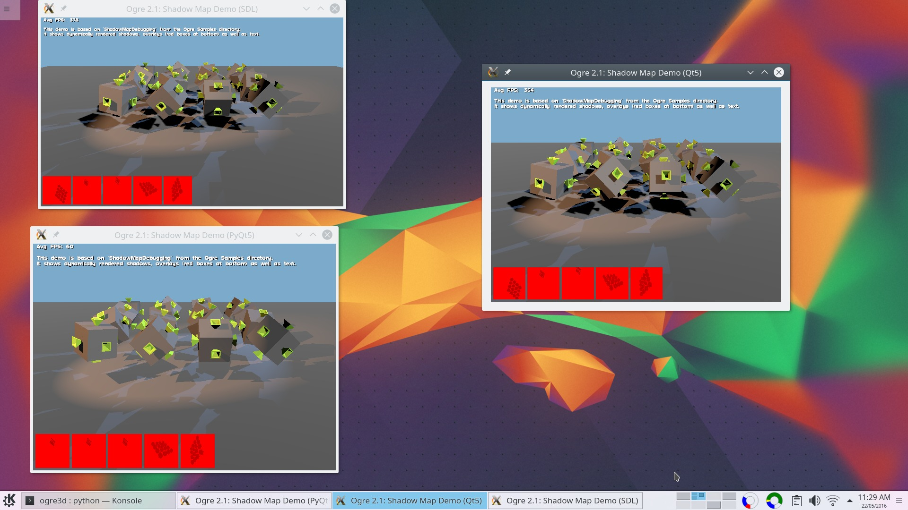

===============================
Minimal Example for Ogre3D v2.1
===============================

The example is based on the official `ShadowMapDebugging` demo that ships with
Ogre. It shows an Ogre v2.1 scene and features several objects, lights, and
dynamic shadows.

The demo comes in three versions: SDL, Qt5, and Python (proof-of-concept only).
Each is coded as a single class, in a single file, with hard coded resource
paths, and without any keyboard/mouse handling. This will hopefully make it
easier to read and understand them.

Docker
======

The Dockerfile details all the steps to build Ogre and the demos in an
Anaconda virtual environments. The virtual environment is not strictly
necessary but makes it easy to keep the Ogre and SDL files out of systems
directories.

To build the container use

.. code-block:: bash

   docker build -t ogre:2.1 .

This may take a while because it will first build Ogre v2.1 as an Anaconda
package and then compile the SDL/Qt5/PyQt5 demos.

Note: the binaries from inside the Docker container are probably useless on
the host system. The sole purpose with Docker here is to show the build
instructions.

Anaconda
========

If you are on (K)Ubuntu 16.04 (64Bit) and have Continuum's Anaconda
distribution installed then you should be able to use my pre-built Ogre
package. If not, you need to build them yourself as per the `Dockerfile`
(see previous section).

Before you start you will need a C++ compiler (`apt-get install
build-essential` on Ubuntu).

Use the following commands to create an Ogre environment, compile the
demos and run them:

.. code-block:: bash

   # Create an Anaconda environment for Ogre v2.1 and SDL.
   conda env create --file environment.yml
   source activate ogre

   # Create Ogre's plugin file.
   ./create_plugins_config.sh

   # Build and run the SDL demo.
   ./build_sdl.sh && sdl/build/sdl_demo

   # Build and run the Qt5 demo.
   ./build_qt.sh && qt/build/qt_demo

   # Build and run the PyQt5 demo.
   ./build_python && python python/pyqt_demo.py

Windows and OS X
================

The code will (presumably) require minor modification before it runs on these
systems - pull requests welcome.

License
=======

All code in this repository is licensed under the terms of the MIT license.
